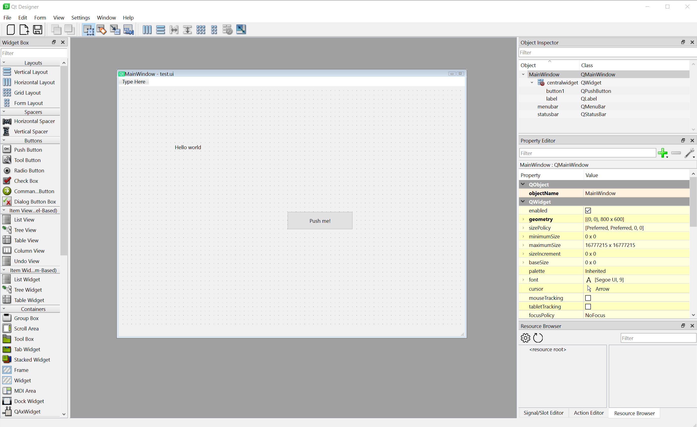
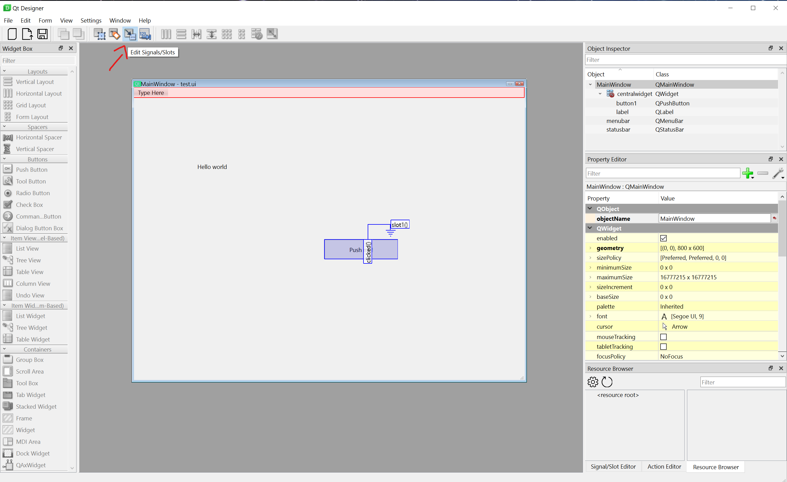

# Development Workflow

This document describes the development workflow for a pyqt6 application. This does will not cover development of regular projects, but rather the development of a pyqt6 application.

## Setup

1. Ensure that you have Python 3.9+ installed.
2. Create a virtual environment named `venv` using `python -m venv venv`
3. Activate the virtual environment
   - On Windows, run `.\venv\Scripts\Activate.ps1`
   - On Mac/Linux, run `source venv/bin/activate`
4. Install the required dependencies by running `pip install -r requirements.txt`.
   - This should only install PySide6 and is the only dependency required for this project (barebones pyqt6 application).
   - Note that this project does not install PyQt6 as it does not provide any additional features that PySide6 does not have. For example the designer tool is not included in this project. It also includes a compiler that will be used the genertated ui files into executable python files

## Project structure

A barebones PyQt project will typically have three main components

1. A series of XML `.ui` files (MainWindow, Widgets, etc) - See [UI Development](#ui-development)
2. The compiled version of those files - See [UI Development](#ui-development)
3. File defining functionality - See [Functionality Development](#functionality-development)

## UI Development

While we can create the UI using code, it is recommended to use the Qt Designer tool to create the UI. This tool allows you to create the UI using a drag and drop interface.

To launch the designer for a clean project, run `pyside6-designer &` in the terminal. To open an existing file in the designer, run `pyside6-designer <filename>.ui &` in the terminal. Note the `&` will run the designer as a background task so it's not blocking the terminal.

Once launched, you can use the interface to place and move components

After you've finished making changes, use `Ctrl+s` to save your work into a `.ui` file. `.ui` files are saved in the XML format meaning that we can't use them immediately after we save them, we have to compile these files to `.py` files that be run using python. To do so we can use the `pyside6-uic` tool in the terminal.

To compile an XML `.ui` file into a `.py` file, run `pyside6-uic <ui filename>.ui -o <py file>.py -a`. Note that we can view the generated code in the terminal without saving it to a file by omitting `-o <py file>.py`. The `-a` option is used to not generate a connectSlotsByName function within the output file, this will be elaborated on in the section about functionality development.

## Functionality Development
The Qt framework uses a "signals and slots" desgin pattern to implement functionality. This is essentially the same as using event handlers in Javascript. Within the designer tools we can add signals (events to listen on) to components and connect those to slots (listener functions)

